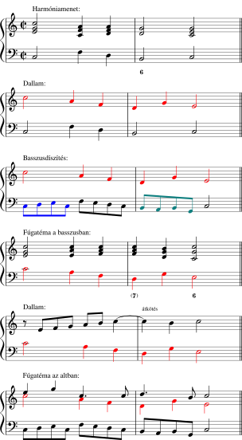

# Előszó

Kedves muzsikus barátom!

Ennek a tankönyvnek az a célja, hogy elindítson azon az úton, hogy a zene nyelvén ki tudd fejezni saját gondolataidat és érzéseidet a pillanatnyi helyzetnek megfelelően. Ez azért csodálatos dolog, mert egyrészt saját belső világodhoz jobban tudsz kapcsolódni, másrészt még mélyebb kapcsolatot tudsz teremteni a Téged hallgatókkal azáltal, hogy aktuális igényeikre reagálva zenei párbeszédet folytathatsz velük.

Ha eddig még nem kóstoltál bele a rögtönzés világába, abban bízom, hogy ezek a gyakorlatok biztonságérzetet adnak és felszabadítanak. Ha pedig úgy érzed, hogy jön Belőled az improvizáció, reményeim szerint abban tudnak segíteni, hogy zenei gondolataidat még strukturáltabban tud megfogalmazni, és így a közönség azt gondolhassa, hogy rögtönzésed voltaképpen egy leírt kompozíció előadása.

## Célközönség

Ez a könyv Neked szól, ha zenei tanulmányaidban már legalább közép- vagy felsőfokon jársz, és szeretnéd elsajátítani a stílusimprovizáció készségét, azaz az elmúlt századok európai, tonális komoly- és könnyűzenei nyelvén történő rögtönzést. (Ha a rögtönzést a zene alapjaitól szeretnéd kezdeni, ill. a jazz világában kívánsz elmélyedni, melegen ajánlom Apagyi Mária *ZongorÁlom*, ill. Gonda János *A rögtönzés világa* c. tankönyveit.)

A gyakorlatok azt feltételezik, hogy már birtokában vagy olyan képességeknek, mint a kottaolvasás, a szolmizáció, valamint a fokszámok, hármashangzatok, négyeshangzatok és fordításaik alapvető ismerete. Előnyt jelent, de nem követelmény a basso continuo-gyakorlat.

Akármilyen hangszeren játszol, találni fogsz magadnak megfelelő gyakorlatokat. Ezek többsége az akkordikus hangszerekre, némelyike specifikusan az orgonára fókuszál, de hangszeredre jellemző technikákkal sikeresen alkalmazhatod őket dallamhangszerekre, ill. énekhangra is.

## Általános szabályok

A legfontosabb alapelv, hogy a játszott anyag fölött *teljes kontrollt* érezz, és előre tudj gondolkodni. Mindig olyan tempót válassz, amiben teljesen ritmikusan el tudod játszani, amit elképzeltél. (Ehhez nagyon hasznos segítség egy kamarapartner – sok gyakorlatban ketten vagy többen is részt vehetnek –, partner híján pedig egy metronóm.) Addig ne haladj tovább a következő gyakorlatra, amíg nincs meg a már említett kontroll érzete, mely egyfajta szabadságérzetet is ad.

Minden gyakorlatot minél többféle, minél különbözőbb variációban végezz el, legfőképp minél több hangnemben.

Amikor ketten két különböző szerepben játszotok, megbeszélés szerint cserélgethettek.

A dúrban és mollban is értelmezhető harmóniasorok fokszámmal vannak jelölve, egyébként az akkordmenetek úgynevezett szolmizált számozott basszussal vannak lejegyezve: ilyenkor a szolmizáció a basszushangot jelzi, a felső indexben levő számok pedig a basszushoz képest számítandó hangközöket.

A gyakorlatokat nem szükséges a könyv elejétől a végéig szigorúan a leírt sorrendben végezni. Az 1-2., valamint a 3-4. gyakorlatsort nagyjából párhuzamosan érdemes feldolgozni, egy fejezeten belül pedig általában nehézség szerint növekednek, ill. egymásra épülnek a feladatok, de a saját képességeid és a gyakorlatok előfeltételeinek figyelembevételével azt javaslom, hogy személyre szabott tanmenet szerint haladj, időnként visszatérve egy-egy gyakorlat nehezített változatára – legjobb, ha van egy tanárod, aki segít ebben.

# Gyakorlatok

## Dallam

Egy szép dallamra mindenki rezonál, így ez a hallgatóság megszólításának egyik kulcsa.

\newpage

### Pentaton improvizáció
* Hangszerelés
    * egy vagy több billentyűs hangszer vagy hárfa pentaton hangolással (c♯, d♯, e♭, f♯, g♯, a♯, b)
* Szabályok
    * Partnered játssza az alábbi kíséretet:  
    
    * Improvizálj dallamot egy kézzel a fekete billentyűkön az A résznél belépve. Ügyelj arra, hogy a dallam változatos és kifejező legyen.
    * Az A-B szakasz váltakozását tetszőleges mennyiségben ismételjétek.
    * Amikor be szeretnéd fejezni, a B rész alatt jelezz, hogy "jön a Coda", és ugorjatok a Codára.
* Variációk
    * Kezdés lá-pentatonnal  
    
    * Karakter
        * Altató  
        
        * Keringő  
        
        * Rumba  
        
        * Bolgár ritmusok
            * (3+2)/8
            * (2+2+3)/8
    * Dallam felrakása
        * két kézzel oktávban
        * két kéz felváltva
        * két kézzel 2 szólamban
    * Dallam felosztása frázisokra
        * 2+2 ütem
        * 1+1+2 ütem
    * Dallam formája
        * periódus: A A~v~
        * zenei mondat: a a~v~ B
* Figyeld meg!
    * A dallam jellegzetes *ritmikától* nyer karaktert.
    * A dallam *csúcspontját* érdemes előre eltervezni.
    * A *nagy hangközöktől* kifejezőbb lesz a dallam.
    * A *motívumismétlődések* koherensebbé teszik a dallamot.

\newpage

### Motívumszekvencia
* Hangszerelés
    * énekhang vagy bármilyen hangszer
* Szabályok
    * Találj ki egy rövid, karakteres motívumot. Jellegzetességét adhatja egy ritmusképlet vagy egy nagyobb hangköz.
    * Játszd el a hangsorának összes hangjáról kezdve sorban felfelé vagy lefelé.
* Példák  

\newpage

### Népdalimprovizáció
* Hangszerelés
    * énekhang vagy bármilyen hangszer
* Szabályok
    * Válassz egy népdalt vagy népies műdalt (giusto ritmikájút).  
    
    * Írd le az alábbi jellemzőit:

    | Jellemző                                               | Példa      |
    | ------------------------------------------------------ | ---------- |
    | sorszerkezet (betűjelekkel, esetleg színekkel jelölve) | A A^5^ A^5^~v~ A |
    | dallamsorok hullámzása (grafikusan ábrázolva)          | ◠ ◠ ∿ ◠    |
    | hangsor                                                | ión        |
    | egy sor hány ütem                                      | 2          |

    * Ilyen vagy némileg módosított tulajdonságokkal rögtönözz egy népdalt, lehetőleg énekelve (pl. lalázva vagy szolmizálva).  
    
* Ötletek (sorszerkezet szerint csoportosítva)
    * A A^5^ A^5^~v~ A
        * Gerencséri utca
        * Száraz fából könnyű hidat csinálni
    * A B B A
        * Csillagok, csillagok
        * Szépen úszik a vadkácsa a vízen
    * A B B~v~ A
        * Erdő, erdő, de magos a teteje
        * Túl a Tiszán faragnak az ácsok
    * A A B A
        * A csitári hegyek alatt
        * Általmennék én a Tiszán ladikon
        * Erdő, erdő, erdő, marosszéki kerek erdő
    * A A B B~v~
        * Kis kece lányom
    * A^5^ A^5^~v~ A A~v~
        * Röpülj, páva, röpülj
        * Béreslegény
* Figyeld meg!
    * Egy természetes dallam levegőnyi *frázisokból* épül fel.
    * Egy frázis *visszatérhet*, akár módosítva; így könnyű megjegyezni, és a hallgatónak is az ismerősség érzését nyújtja.
    * Rögtönzéskor bátran indulj ki *meglevő anyagból*.

\newpage

### Dallam akkordinga fölé
* Hangszerelés
    * akkordikus hangszer
    * énekhang vagy bármilyen hangszer (opcionális)
* Szabályok
    * Partnered váltogasson két akkordot az alábbi séma szerint:  
    
    * Improvizálj fölé dallamot.
    * Az akkordinga addig ismétlődjön, amíg nem jelzel.
* Variációk
    * Ha az akkordok hangjai még nem mennek gondolkodás nélkül, először partnered vagy egy harmadik játékos játsszon elő dallamokat, Te pedig ismételd őket.  
    
\newpage
    * Fokozatosan vezess be díszítőhangokat.  
    
        * Csak akkordhangok
        * Akkordhangok + átmenő hangok
        * Akkordhangok + váltóhangok
        * Akkordhangok + késleltetések
        * Mindenféle díszítés
    * V. fok helyett vegyél más akkordot:
        * IV
        * II (csak dúrban)
        * VII (csak természetes mollban)
        * VI
        * III
    * A két akkord fordítva is váltakozhat.
    * Próbálkozhattok modális hangsorokkal is.
    * Válassz egy-egy motívumot, és mindkét akkord fölé játszd a megfelelő skálahangról kezdve úgy, hogy illeszkedjen a harmóniához.
* Figyeld meg!
    * Egy dallam elsősorban (főleg súlyokra) az aktuális harmónia, másodsorban (főleg ütésekre) az aktuális hangsor hangjaiból építkezik.

\newpage

### Dallam akkordsor fölé
* Hangszerelés
    * akkordikus hangszer
    * énekhang vagy bármilyen hangszer (opcionális)
* Szabályok
    * Válassz egy érdekes akkordsort.
    * Partnered ismételgesse jelzésig, Te pedig improvizálj fölé dallamot. (Kezdetben minél egyszerűbb dallamokra törekedj.)
* Ötletek
    * [Akkordsorok]
    * barokk chaconne-ok
    * könnyűzenei számok
* Variációk
    * Szólamok eloszlása
        * Partner: basszus, Te: harmóniák + dallam
        * Te: basszus + dallam
        * Te: basszus + harmóniák + dallam

\newpage

### Egyveleg
* Hangszerelés
    * akkordikus hangszer
    * énekhang vagy bármilyen hangszer (opcionális)
* Szabályok
    * Válassz egy népszerű akkordsort, és gyűjts minél több komolyzenei művet vagy könnyűzenei számot, amely rá épül.
    * Partnered ismételgesse a harmóniasort, Te pedig játszd a művek dallamait egymás után.
* Példák
    * [Pachelbel: Canon](https://www.youtube.com/watch?v=AfBOBmxVsvc)
    * [La Folia](http://www.folias.nl/html4.html)
    * [Romanesca](http://www.earlymusicsources.com/home/more/romanesca)
    * [d-s-l-f](https://www.youtube.com/watch?v=oOlDewpCfZQ)
    * [d-l-f-s](https://www.youtube.com/watch?v=B_Smt1VsoqQ)
    * Autentikus szekvencia
        * [1](https://www.youtube.com/watch?v=aadnLisADs4)
        * [2](https://www.youtube.com/watch?v=9l7ey3v5wT8)
    * [Blues-kör](https://www.youtube.com/watch?v=ZaO3CbsOsX0)

\newpage

### Dallam dalkíséret fölé
* Hangszerelés
    * akkordikus hangszer
    * énekhang vagy bármilyen hangszer (opcionális)
* Szabályok
    * Válassz egy dalt egyszerű, végig hasonlóan figurált kísérettel vagy egy olyan tételt, amely gyakorlatilag egy figurált akkordsor.
    * Partnered játssza a harmóniákat, Te pedig improvizálj fölé dallamot.
* Ötletek
    * Bach: Das Wohltemperierte Klavier I. C-dúr prelúdium (Gounod: Ave Maria)
    * Bach: Das Wohltemperierte Klavier I. c-moll prelúdium
    * Bach: c-moll kis prelúdium
    * Saint-Saëns: Az állatok farsangja - Hattyú
* Variációk
    * Partnered a kíséretet ne kottából, hanem harmóniai vázból játssza.

\newpage

## Variáció

Hallgatóidat bevonhatod az alkotói folyamatba, ha kérsz tőlük egy témát, melyet különféle módosításoknak vetsz alá. Így ők is kíváncsian hallgatják az általuk kedvelt mű alakulását, Neked pedig már adott egy zenei anyag, mely sok mindent meghatároz.

\newpage

### Egy akkord – több karakter
* Hangszerelés
    * akkordikus hangszer
* Szabályok
    * Válassz egy akkordot.
    * Játszd minél szélsőségesebben különböző felrakásokban, szólamszámmal, dinamikával, artikulációval; legalább háromféle változatban.  
    

\newpage

### Díszítés

#### Dallamdíszítés
* Hangszerelés
    * énekhang vagy bármilyen hangszer
    * akkordikus hangszer (opcionális)
* Szabályok
    * Válassz egy dallamot, pl. egy népéneket, népdalt, dalt, áriát stb.
    * Improvizálva díszítsd ki a stílusra jellemző motívumokkal.  
    
* Variációk
    * A dallamot fele tempóban is játszhatod, így még több díszítéssel gazdagíthatod.
    * Ha van kísérete a dallamnak, azzal együtt is lehet játszani a következő szólambeosztások szerint:
        * Partner: kíséret, Te: dallam
        * Partner: basszus, Te: harmóniák + dallam
        * Te: basszus + dallam
        * Te: basszus + harmóniák + dallam
* Példák
    * [Bach: Ich ruf zu Dir, Herr Jesu Christ BWV 639](https://imslp.org/wiki/Special:ImagefromIndex/129004/uhoh) (folytasd a díszítést!)
    * [Bach: O Mensch, bewein dein Sünde groß BWV 622](https://imslp.org/wiki/Special:ImagefromIndex/193359/uhoh)
    * [Bach: Schmücke dich, o liebe Seele BWV 654](https://imslp.org/wiki/Special:ImagefromIndex/26115/uhoh)

\newpage

#### Basszusdíszítés
* Hangszerelés
    * akkordikus hangszer
* Szabályok
    * Válassz egy akkordsort.
    * A basszusát díszítsd ki a stílusra jellemző motívumokkal, egyre sűrűbb ritmusértékekkel gyakorolva.
* Példák  
  

\newpage

### Figuráció
* Hangszerelés
    * akkordikus hangszer
* Szabályok
    * Válassz egy akkordsort vagy egyszerű akkordkíséretes tételt.
    * Figuráld a kíséretét különféle módokon. Pár ötlet:  
    

\newpage

### Felrakás
* Hangszerelés
    * orgona
* Szabályok
    * Válassz egy népének-kíséretet, pl. az alábbi kötetekből:
        * Bach: Négyszólamú korálfeldolgozások
        * Szent vagy, Uram!
        * Evangélikus Énekeskönyv
    * Játszd a következő felrakásokban, különféle regisztrációkkal:
        * Pedál: basszus 16' regiszterrel, manuál: többi szólam
        * Pedál: basszus 16' regiszterrel, főmű: dallam, másik manuál: kíséret
        * Pedál: basszus 16' regiszterrel, főmű: dallam oktávval lejjebb, másik manuál: kíséret
        * Pedál: dallam 4' vagy 8' regiszterrel, manuál: többi szólam
        * Pedál: dallam 4' vagy 8' regiszterrel, főmű: basszus 16' regiszterrel, másik manuál: kíséret
        * Pedál: basszus + dallam 8' vagy 16' regiszterrel, manuál: kíséret

\newpage

### Bővítés

#### Akkordok beszúrása
* Hangszerelés
    * akkordikus hangszer
* Szabályok
    * Válassz egy akkordsort.
    * A súlyos helyekre játssz késleltetéseket.
    * A súlytalan helyeken, ahol nem változik a harmónia, játssz új akkordokat.
* Példa  

\newpage

#### Echo
* Hangszerelés
    * énekhang vagy bármilyen hangszer
* Szabályok
    * Válassz egy témát, mely jól elkülöníthető frázisokból áll.
    * Minden frázis után játszd visszhangszerűen a frázis utolsó felét.
* Variációk
    * Az echót tetszőlegesen variálhatod, pl. díszítheted.
* Példák
    * [Sietze de Vries: Wer nur den lieben Gott läßt walten](https://www.youtube.com/watch?v=DHdAR4aV9Aw)
    * [Sietze de Vries: Ein feste Burg ist unser Gott](https://www.youtube.com/watch?v=Bk75PrwcTNU)

\newpage

#### Álzárlatos coda
* Hangszerelés
    * akkordikus hangszer
* Szabályok
    * Válassz egy akkordsort.
    * A záró I. fok helyett játszd az alábbi akkordok valamelyikét, vagy többet egymás után:
      * VI
      * I^7♭^
      * I^5♭\ 6^
      * I^3♭\ 4^
      * I~♭~^2^
    * Ezután játssz egy IV-I zárlatot.
* Variációk
    * Az I. fokú mellékdomináns előtti V. fok lehet moll színezetű.
    * Dúrban a VI. fok lehet mollbeli.
* Példák
    * [Bach: Nun komm' der Heiden Heiland BWV 599](https://imslp.org/wiki/Special:ImagefromIndex/128963/uhoh)
    * [Bach: Der Tag, der ist so freudenreich BWV 605](https://imslp.org/wiki/Special:ImagefromIndex/128969/uhoh)
    * [Bach: Mit Fried' und Freud' ich fahr dahin BWV 616](https://imslp.org/wiki/Special:ImagefromIndex/128981/uhoh)

\newpage

### Lüktetés megváltoztatása

#### Proportio
* Hangszerelés
    * énekhang vagy bármilyen hangszer
* Szabályok
    * Válassz egy páros metrumú tánctételt.
    * Játszd le, majd utána rögtönözd a hármas metrumú változatát.
* [Ötletek](https://www.tankonyvtar.hu/hu/tartalom/tamop425/2011_0001_522_Magyar_zenetortenet/ch04s13.html)
    * Lőcsei virginálkönyv
    * Stark-féle virginálkönyv
    * Kájoni-kódex
    * Vietorisz-kódex
* Példák
    * [Speer: Musikalisch-Türkischer Eulen-Spiegel - táncok](https://www.youtube.com/playlist?list=PLDrg2ayMaZy7R_3sPdSmEU2vr9h7U3TQQ)

\newpage

#### Partita
* Hangszerelés
    * énekhang vagy bármilyen hangszer
* Szabályok
    * Válassz egy témát:
        * dallam
        * akkordsor
        * teljes téma
    * Válassz 3-5 különböző lüktetésű tánctípust (ld. [Stílusok]).
    * Játszd a témát a tánctételek lüktetése, ritmikája és karaktere szerint, szükség szerint díszítve a dallamot.
* Példa: Kis kece lányom  

\newpage

### Újraharmonizálás
* Hangszerelés
    * akkordikus hangszer
* Előfeltétel
    * [Harmonizáció]
* Szabályok
    * Válassz egy dallamot.
    * Játszd különféle harmonizációkkal.
* Példák
    * [Publio Delgado](https://www.youtube.com/user/vendidou/videos)
    * Harmath Dénes
        * [Boldogság, gyere haza](https://www.youtube.com/watch?v=QIptYgLIHj4)
        * [Szerelem első vérig](https://vimeo.com/286490988)
        * [Petróleumlámpa](https://www.youtube.com/watch?v=sZ13vNxKtg8)

\newpage

### Korálelőjáték
* Hangszerelés
    * orgona
* Szabályok
    * Válassz egy népének-kíséretet.
    * Válassz néhány variációs lehetőséget az eddig említettek közül.
    * Alkalmazz egyre több ilyet a kíséretre, egyszerre mindig csak egyet.
* Variációk
    * Ha a liturgiában kevés idő van, a népéneknek csak az első (vagy első kettő) és utolsó sorát vedd.
* Példák  
  

\newpage

### Transzponálás, transzformálás

#### Minore-maggiore váltás
* Hangszerelés
    * énekhang vagy bármilyen hangszer
* Szabályok
    * Válassz egy dúr vagy moll dallamot.
    * Ha dúrban van, mollban játszd el és fordítva.
* Ötletek
    * Karácsonyi énekek
    * In the Mood
    * Chopin: Gyászinduló
    * Beethoven: Holdfény-szonáta - 1. tétel
* Példák
    * [Oleg Berg](https://www.youtube.com/user/MajorVsMinor/videos)
    * [Mahler: 1. szimfónia - 3. tétel](https://www.youtube.com/watch?v=RQCHgnpCGf4)
    * [Tales of Monkey Island - LeChuck's Theme](https://www.youtube.com/watch?v=pgYVTBC4Ptg)

\newpage

#### Transzformálás másik skálahangra
* Hangszerelés
    * énekhang vagy bármilyen hangszer
* Szabályok
    * Válassz egy dúr vagy moll dallamot.
    * Játszd el a hangsorának főbb hangjairól kezdve:
        * V. fok
        * IV. fok
        * III. fok
        * VI. fok
* Variációk
    * [Harmonizációs][Harmonizáció] gyakorlat birtokában harmonizáld meg mindegyik hangról kezdődő változatot.
* Példa: [Liszt: Ad nos, ad salutarem undam](https://imslp.org/wiki/Special:ImagefromIndex/512323/uhoh)

\newpage

#### Transzformálás másik hangsorba
* Hangszerelés
    * énekhang vagy bármilyen hangszer
* Szabályok
    * Válassz egy dúr vagy moll dallamot.
    * Játszd el egy minél egzotikusabb hangsorban.
* Ötletek
    * modális skálák
    * modellskálák
    * bő szekundos skálák
* Példa: Boci, boci, tarka - cigányskála  

\newpage

#### Ritornell kamarában
* Hangszerelés
    * egy vagy több tetszőleges hangszer
* Szabályok
    * Válassz egy rövid (4 vagy 8 ütemes) témát.
    * Játszd el, majd partnered egy átvezető résszel moduláljon egy új hangnembe, ezután Te pedig abban a hangnemben játszd a témát, amibe az átvezetés eljutott.
    * Ezt folytassátok párszor, az utolsó témára pedig jussatok vissza az eredeti hangnembe.
* Variációk
    * A hangnemtervet megbeszélhetitek előre, vagy hallás után lekövetheted.
    * Az átvezetések hosszát megbeszélhetitek előre, vagy erős zárlattal tegye őket egyértelművé a partnered.
* Példák:
    * [Vivaldi: A négy évszak - Ősz - 1. tétel](https://imslp.org/wiki/Special:ImagefromIndex/73457/uhoh)
    * [Sietze de Vries: Concerto di segnor Vriescobaldi](https://www.youtube.com/watch?v=Vis97y1WFE8)

\newpage

### Stílusjegyek felismerése és alkalmazása
* Hangszerelés
    * akkordikus hangszer
* Előfeltétel
    * [Stílusok]
* Szabályok
    * Válassz egy népszerű témát, mely elég rugalmasan feldolgozható (pl. gyerekdal vagy népdal).
    * Válassz egy zenei stílust vagy egy zeneszerzőt, és műveinek elemzésével írj össze pár rá jellemző stílusjegyet. Gyakorold ezen építőelemeket.
    * Variáld úgy a témát, hogy ezeket a stílusjegyeket jól felismerhetően alkalmazod rá.
* Példák
    * [Richard Grayson](https://www.youtube.com/user/improvelectronic/videos)
    * [Harmath Dénes](https://thsoft.bandcamp.com/album/improviz-ci-k-n-pszer-t-m-k-k-l-nb-z-st-lusokban)

\newpage

## Saját anyag

Előfeltétel:

* [Dallam]
* [Variáció]

Eljutottál oda, hogy olyan zenei anyagot rögtönözz, melynek minden paraméterét Te határozod meg. Ez nem azt jelenti, hogy bármiféle támpont nélkül kéne a semmiből valami teljesen eredetit megalkotnod. Az alábbi módokon tudsz magadon segíteni:

* *Jegyezz le* magadnak annyi információt, amennyiből valós időben már teljes zenei gondolatokat tudsz játszani. Ha egyelőre úgy érzed magad biztonságban, hogy szinte hangról hangra lekottázod, amit játszani fogsz, nyugodtan tegyél így. Sok gyakorlással szép fokozatosan eljuthatsz oda, hogy teljes tételeket tudj rögtönözni mindössze pár grafikus szimbólum és betű előzetes lejegyzése alapján. Ugyanakkor tapasztaltabb improvizátorként sem érdemes megspórolni a jegyzeteket, hogy minél kevesebb dolgot kelljen a fejedben tartani.
* Sokszor nem végtelen sok lehetőség közül kell választanod, hanem *véges számú* jól bevált séma közül. Az, hogy ezek jól beváltak, nem azt jelenti, hogy sablonosak lennének, épp ellenkezőleg: ezekkel még jobban meg tudod szólítani a közönséget, hiszen kedvenc szerzőiktől már hallották ezeket a megoldásokat, és így ismerősként fogják üdvözölni őket.

Most pedig fokozatosan, építőelemenként felépítünk zenei struktúrákat, mintha épületek lennének. A gyakorlatok végrehajtása során mindig az alábbi lépéseket kövesd:

* Először írd fel a kompozíció harmóniai és formai vázát. Végy egy akkordsort, 1 ütemben 1 vagy legfeljebb 2 akkordot véve. Írd le vázlatos lejegyzésmóddal (fokszámok vagy kottázott/szolmizált számozott basszus), és játszd le, mintha continuóznál – nem kell a négyszólamú szerkesztés szabályaival törődni. (A formai vázról később esik szó.) Épületed ezennel szerkezetkész: szilárd alappal és stabil struktúrával rendelkezik.
* Adj hozzá karaktert. Végy egy tánctételt, mely meghatározza a metrumot és a jellemző ritmusképletet; válassz egy figurációt, és alkalmazd (ld. [Variáció]). Így berendezted és kifestetted az épületedet, már el tudja látni funkcióját, de még kissé sivár.
* Adj hozzá dallamot (ld. [Dallam]). A harmóniák expresszivitását növelheted késleltetések bevezetésével. Épületed most már ki van díszítve képekkel, növényekkel stb.

Összefoglalva:

| Zene                                                   | Architektúra         |
| ------------------------------------------------------ | -------------------- |
| struktúra (akkordsor, *lassú harmóniaritmus*)          | szerkezet            |
| karakter (lüktetés, ritmusképlet, figuráció, szünetek) | berendezés, kifestés |
| dallam (motívumok, késleltetések)                      | díszítés             |

A folyamatra példákat a [Téma] c. alfejezetben találsz.

\newpage

### Frázis

A zene időbeli alapegysége a frázis (mint azt a népdaloknál már láttuk). Hossza lehet alapvetően:

* 2 akkord: ld. [akkordinga][Dallam akkordinga fölé]
* 4 vagy 8 akkord: ld. az alábbi gyakorlatok

#### Tipikus tematikus akkordsorok
* Hangszerelés
    * akkordikus hangszer
* Szabályok
    * Válassz egy akkordsort az alábbi gyakran előforduló típusok közül:
        * teljes zárlat: I-IV-V-I
        * félzárlat: I-VI-IV-V
        * ereszkedő: I-V^6^-IV^6^-V
        * emelkedő: I-VII^6^-I^6^-V
    * Variáld úgy, hogy néhol [beszúrsz][Akkordok beszúrása] akkordokat, vagy bizonyos akkordokat hasonló funkciójúakkal helyettesítesz (pl. IV. fok helyett váltódomináns).

\newpage

#### Saját akkordsor
* Hangszerelés
    * akkordikus hangszer
* Szabályok
    * Alkoss 4, majd később 8 akkordból álló akkordsorokat.
      * Elsősorban a főhármasokat alkalmazd:
          * I
          * V
          * IV
      * Másodsorban a mellékhármasokat:
          * II
          * III
          * VI
          * VII (alaphelyzetben csak négyeshangzatként vagy tá/szó basszussal)
      * Fokozatosan vezess be fordításokat.
      * Végül alterációkkal színezd az akkordokat.

\newpage

### Szekvencia
* Hangszerelés
    * akkordikus hangszer
* Szabályok
    * Válassz egy szekvenciát:
        * autentikus: l-r-s-d-f-t^**7**^-m^♯^-l
            * hosszabb forma: d-r-s-d-f-t^**7**^-m-l-r-s-d-f-s^**4**^-s^**3**^-d
        * plagális-autentikus: d-s-l-m-f-d-s-d
            * hosszabb forma: d-s-l-m-f-d-r-l-ta-f-s-r-m-t^**6**^-d
        * autentikus-plagális: d-f-r^(♯)^-s-m^(♯)^-l-f-d
            * hosszabb forma: d-f-r^(♯)^-s-m^(♯)^-l-f-ta-s-d-l^(♯)^-r-t^♯^-m-d
        * plagális: d-s-r-l-m-f-s-d
    * Játszd kívülről.
* Variációk
    * Fordításokban is játszd az akkordokat, például:
        * autentikus:
            * l^**7**^-r^**7**^...
            * l-f^**5 6**^...
            * d-d^**2**^-t^**5 6**^...
            * d-r^**7**^-r^**3 4**^...
        * plagális-autentikus: d-t^**6**^-l-s^**6**^...
        * autentikus-plagális: m^**6**^-f-fi^**6**^...
        * plagális: d-m^**6**^-s-t^**6**^...
    * Válassz egy motívumot, amely akkordonként váltakozzon a szólamok között:  
    
        * szoprán-basszus
        * szoprán-alt (háromszólamú felrakásban)
            * Díszítsd a basszust.

\newpage

### Téma

#### Egyszerű téma

Egy rövid téma 2-4 frázisból áll. Egy frázis lehet:

* arzis/kérdés/félzárlat (jelölése: ?)
* tézis/felelet/teljes zárlat (jelölése: !)

A rögtönzés előtt tervezd meg a téma formáját betűjelekkel. Tipikus formák:
\newpage

* kéttagú forma: A B  

\newpage
* periódus: A? A~v~!  

\newpage
    * kontrasztáló periódius: a b? a c!  
    
\newpage
* zenei mondat: a a~v~ B  

\newpage

#### Moduláló téma

Előfeltétel: [Ritornell kamarában]

Egy bonyolultabb téma 4-5 frázisból áll, melyek között van az alaphangnemtől eltérő. Tipikus hangnemek az alaphangnemhez képest:

* +/-1 kvint
* párhuzamos
* minore/maggiore
* tercrokon

A formatervet bővítsd ki a hangnemtervvel. Tipikus formák:
\newpage

* kvintváltós négytagú forma: A A^5^ B? C!  

\newpage
* kvintváltós népdalforma: A A^5^ A^5^~v~ A / A A^5^ b b~v~ A  

\newpage
* négytagú forma: A B C D  

\newpage
* szűkített háromtagú forma: A A~v~ B A~v~  

\newpage

#### Bővítés

Amikor már stabilan érzed, hogyan kell szimmetrikus (tehát pl. 2-szer 4 vagy 4-szer 4 ütemes) zenei struktúrákat létrehozni, külső vagy belső bővítést alkalmazhatsz, ami plusz 1 vagy 2 frázis beszúrását jelenti (leggyakrabban periódusba). Ez jól alkalmazható arra, hogy plusz feszültségként később jussunk el a várva várt zárlatig, valamint hogy apró szabálytalansággal tegyük kevésbé kiszámíthatóvá a formát.

Először mindig játszd el a bővítés nélküli, szimmetrikus témát, majd pedig a bővített változatot.

Tipikus bővítési technikák:

* belső
    * motívum megismétlése
    * szekvencia folytatása
* külső
    * echo
    * álzárlat + coda

Példák:

* [Mozart: 1. szonáta (K279) - 3. tétel](http://imslp.eu/files/imglnks/euimg/1/15/IMSLP456558-PMLP01830-Mozart,_Wofgang_Amadeus-NMA_09_25_1_01_KV_279_scan.pdf)
* [Mozart: F-dúr Allegro (K15a)](https://imslp.org/wiki/Special:ImagefromIndex/107397/uhoh)

\newpage

### Moduláció szekvenciával
* Hangszerelés
    * akkordikus hangszer
* Szabályok
    * Válassz két hangnemet max. 4 kvint távolságra.
    * A kvintkörön lefelé:
        * Játszd úgy az autentikus szekvenciát, hogy minden akkord dominánsszeptim legyen, így süllyedhet
    * A kvintkörön felfelé:
        * A kiindulási hangnemben kezdd el az autentikus vagy az autentikus-plagális szekvenciát, és amikor az új hangnem V. fokának megfelelő basszushang jön, azt az akkordot alterálva játszd.
    * Végül játssz a záró hangnemben egy I-IV-V-I zárlatot.
* Példák  

\newpage

### Reális szekvencia
* Hangszerelés
    * akkordikus hangszer
* Szabályok
    * Válassz egy akkordkapcsolatot és egy hangközt.
    * Képezz belőle reális szekvenciát a választott hangközönként lépkedve, amíg vissza nem érsz a kiindulási hangmagassághoz.
* Példa: V^6^-I kis tercenként felfelé  

\newpage

### Tétel

Egy teljes zenei tétel több, egymással kontrasztáló témából áll, melyek közül egy vagy több *visszatér*. Ezenkívül átvezető zenei anyagokat is tartalmazhat (ez lehet például [moduláló szekvencia][Moduláció szekvenciával]). Minél több tulajdonsága különbözik a témáknak (a metrumot és tempót kivéve), annál jobb – ezeket a tulajdonságokat is írd le az egyes témákhoz.

#### Triósforma

* Főrész
* Középrész
* Főrész

Tipikus műfaj: menüett

#### Könnyűzenei forma

* Verse
* Refrén
* Verse
* Refrén
* Refrén (félhanggal feljebb)

#### Rondóforma

* Rondótéma
* 1\. epizód
* Rondótéma
* 2\. epizód
* Rondótéma
* (3\. epizód
* Rondótéma)

Tipikus műfaj: gavotte

#### Nyitányforma

* Lassú rész
* Gyors rész
* Lassú rész
* (Gyors rész
* Lassú rész)

Tipikus műfaj: ouverture

#### Ritornell

* Ritornell
* 1\. közjáték
* Ritornell +1
* 2\. közjáték
* Ritornell parallel
* 3\. közjáték
* Ritornell

Tipikus műfaj: concerto

#### Fantázia

* Téma
* Téma +1
* Szekvencia
* Orgonapont
* Zárlat
* Coda: Téma -1

Tipikus műfaj: prelúdium

#### Nagy kéttagú forma

* 1\. rész
    * Téma
    * Szekvencia
    * Zárlat +1
* 2\. rész
    * Téma +1
    * Téma -1 parallel
    * (Szekvencia)
    * Zárlat

Tipikus műfaj: bármilyen barokk tánctétel

#### Variációs forma

* Téma
* 1\. variáció
* 2\. variáció
* stb.

Tipikus technika: [Minore-maggiore váltás]

#### Hídforma

* A
* B
* C
* B
* A

Tipikus stílus: XX. század

#### Szonátaforma

* Expozíció
    * Főtéma
    * Átvezetés, moduláció +1-be
    * Melléktéma +1
    * Zárlat +1
* Feldolgozás
    * Témák, motívumok transzponálva, transzformálva
* Repríz
    * Főtéma
    * (Átvezetés)
    * Melléktéma
    * Zárlat

Lépések:

* Először csak az expozíciót gyakorold.
* Ezután játszd az expozíciót és a reprízt egymás után, először úgy, hogy az átvezető rész teljesen elmarad.
* Készíts egy olyan változatot az átvezető részből, mely az alaphangnemben marad. Játszd el az átvezető rész kétféle verzióját egymás után, tudatosítva a különbséget.
* Játszd az expozíciót és a reprízt egymás után a kétféle átvezető résszel.
* Tervezd meg a már megismert módon és játszd el a feldolgozási részt.
* Játszd el a teljes szonátát.

\newpage

### Fúga

Előfeltétel:

* [Harmonizáció]
* [Felrakás]

A fúga alapja a harmonizáció: mindig a fúgatéma megharmonizálása kell, hogy a szemed előtt lebegjen. A fúgának nincs meghatározott formája, de egy tipikus formaterv a következő:

* Expozíció
    * Téma
    * Téma +1
    * (Szekvencia)
    * Téma
    * Téma +1 vagy szekvencia
    * Zárlat +1
* Feldolgozás
    * Témák különböző hangnemekben, váltakozva szekvenciákkal
* (Fokozás
    * Augmentálás/stretto
    * Zárlat)

Kezdetben érdemes alla breve metrumú, szinkopált karaktert választani.

#### Expozíció és feldolgozás

##### Fúgatéma és tematikus részek

* Alkoss egy témát a fejezetben megismert folyamathoz hasonlóan:
    * Harmóniamenet
    * Dallam - ez lesz a fúgatéma
    * Basszusdíszítés - ez lesz a kontraszubjektum
* Harmonizáld meg a fúgatémát basszusként is.
* Gyakorold a témát a +1 kvintes és egyéb hangnemekben, különböző felrakásokban, csökkenő szólamszámmal.

##### Közjátékok

Gyakorolj imitációs szekvenciákat a fúgatéma és a kontraszubjektum motívumaiból.

##### Teljes fúga

* Külön-külön az expozícióra és feldolgozásra:
    * Tervezd meg a rész felépítését, felírva az alábbi jellemzőket:
        * Témabelépések: hangnem, témát tartalmazó szólam
        * Közjátékok: kezdő, záró hangnem
    * Játszd el az adott részt.
* Játszd el a teljes fúgát.

#### Fokozás

##### Augmentálás

Harmonizáld meg a fúgatémát 1 hang 2 akkord harmóniaritmussal.

##### Stretto

A stretto (tématorlasztás) technikája feszegeti az improvizáció kereteit, de egy egyszerű trükkel megvalósítható: a fúgatémát úgy építsd fel, hogy 2 (vagy 4) ugyanolyan harmóniamenetű, de eltérő ritmikájú frázisból álljon. Így a fúgatéma részfrázisai egymással egyszerre játszva is jól szólnak. Gyakorold az így kialakított téma torlasztását először 2 szólamban, majd hozzájátszva a basszust.

\newpage

## Harmonizáció

Előfeltétel: [Dallam]

A harmonizáció az egyik legösszetettebb zenei tevékenység, hiszen egy dallamhoz kell megtalálni a hozzá illő harmóniákat úgy, hogy azok egymás után is szervesen kapcsolódjanak. Nagyon fontos, hogy a dallamimprovizáció már készség szinten menjen, hogy elegendő élménnyel rendelkezz dallam és harmónia egymáshoz illesztéséről.

\newpage

### Basszusharmonizáció
* Hangszerelés
    * akkordikus hangszer
* Szabályok
    * Válassz egy dallamot.
    * A dallam mint basszus fölé játssz harmóniákat (főleg ütésekre). A leggyakoribb akkordok (bonyolultság szerint növekvő sorrendben):
        * alap
        * 6
        * 4-3 késleltetés
        * 7-6 késleltetés
        * 2 (késleltetés vagy átmenő)  
        
* Variációk
    * A szoprán szólamban játssz szép, dallamos ellenszólamot egy adott karakter szerint.

\newpage

### Zsoltártónus-harmonizáció
* Hangszerelés
    * akkordikus hangszer
* Szabályok
    * Válassz egy [római zsoltártónust](https://www.villanyharfa.hu/misc/articles/zene-tar/zsoltarok/zsoltardallamok/Romai_tonusok_akkordokkal_K.pdf).
    * Harmonizáld meg konszonanciákkal egyre több hangját (a többi hangra maradhat az akkord tartva) az alábbi kottapélda szerinti sorrendben.  
    
* Variációk
    * Később neomodális alterációkat (pl. mollbeli, félszűk, akusztikus akkordok) is bevezethetsz.
    * Válassz egy zsoltárszöveget, amit a tónusra alkalmazol, és úgy harmonizáld meg, hogy a harmóniák, dallamvonalak minél inkább kifejezzék a szöveget.

\newpage

### Mixtúra
* Hangszerelés
    * akkordikus hangszer
* Szabályok
    * Válassz egy dallamot és egy akkordot.
    * A dallam alá vagy fölé játszd mixtúraszerűen az akkordot tonálisan (a dallam hangsora szerint) vagy reálisan.

\newpage

### 1 ütem 1 akkord
* Hangszerelés
    * akkordikus hangszer
* Szabályok
    * Válassz egy dallamot, melynek harmóniaritmusa egy vagy fél ütem akkordonként.
    * Harmonizáld meg főhármasokkal az alapján, hogy milyen akkordhangokat jár körbe egy-egy ütemnyi dallam. Ügyelj az esetleges díszítőhangokra, melyek akár súlyosak is lehetnek.
* Ötletek
    * Happy Birthday
    * Boci, boci, tarka
    * Pál, Kata, Péter
    * Kis kece lányom

\newpage

### 1 hang 1 akkord

#### Dallamtöredék
* Hangszerelés
    * akkordikus hangszer
* Szabályok
    * Válasszatok egy hangnemet.
    * Partnered játsszon 2 hangos teljes zárlatokat a választott hangnemben, Te pedig ismételd meg őket megharmonizálva (1-1 akkordkapcsolattal).
    * Ezután jöjjenek 2 hangos dallamtöredékek, melyek nem feltétlenül zárlatok.
    * Növeljétek a dallamtöredékek hosszát hasonló rendszerben:
        * 3 hangos zárlat
        * 3 hang
        * 4 hangos zárlat
        * 4 hang

\newpage

#### Korál
* Hangszerelés
    * akkordikus hangszer
* Szabályok
    * Válassz egy koráldallamot.
    * Írd le előre minden korálsorról, hogy milyen hangnemben kezdődik és végződik, valamint hogy milyen zárlattal.
    * Korálsoronként játszd el először a dallamot, majd megharmonizálva.

\newpage

### 1 hang 2 akkord
* Előfeltétel
    * [Korálharmonizálás][Korál]
    * [Akkordbeszúrás][Akkordok beszúrása]
    * [Szekvencia]
* Hangszerelés
    * akkordikus hangszer
* Szabályok
    * Harmonizálj meg egy korált egy hangra egy akkordot véve.
    * Szúrj be akkordokat, hogy minden hangra 2 akkord essen. Alkalmazd gyakran az alábbi technikákat, melyekkel elérhető, hogy a basszus dupla olyan gyorsan mozogjon, mint a dallam, a fokszám változása nélkül:
        * alap-szext
        * átmenő szekund
        * basszuskésleltetés
        * kromatikus basszus
        * késleltetés, basszusban oktávugrás
    * Ahol a dallam skálában mozog, ott javasolt szekvenciával megharmonizálni.
        * lefelé:
            * autentikus
            * plagális-autentikus
        * felfelé:
            * autentikus-plagális
            * plagális

\newpage

### Változó harmóniaritmus
Amikor a harmonizáció egyenletes harmóniaritmussal biztosan megy, ritkítsd a harmóniaritmust, ahol felismered, hogy a dallam több hangig egy akkordot jár körbe; vagy sűrítsd, ahol jónak látod (pl. a dallam megáll). A cél, hogy minél dallamosabb basszust kapj.

\newpage

### Közjátékos korálelőjáték
* Előfeltétel
    * [Ritornell]
* Hangszerelés
    * orgona
* Szabályok
    * Válassz egy népénekdallamot, egy karaktert, [felrakást][Felrakás] és figurációt.
    * Találj ki egy közjátékot, mely ritornello-szerűen a dallamsorok között fog különböző hangnemekben megjelenni, és írd le a harmóniai vázát.
    * Írd fel a formai és hangnemtervet, vagyis hogy a ritornellók és korálsorok hogyan következnek egymás után, valamint milyen hangnemben kezdődnek és végződnek.
    * A korálsorokra saját harmonizációt véve játszd el a korálelőjátékot.
* Példa: [Harmath Dénes: Mint a szép híves patakra - Händel-nyitány](https://thsoft.bandcamp.com/track/mint-a-sze-p-hi-ves-patakra-h-ndel-nyit-ny)

# Stílusok

Az elsajátítani kívánt stílusból, ill. szerzőtől származó művek közül minél többet:

* blattolj végig
* találd meg és jelöld be bennük az alábbi jelenségeket
* tanulj meg kívülről
* válassz belőlük egy témát, és játszd el úgy, hogy egy jellemzőt megváltoztatsz

\newpage

## Reneszánsz

### Zenei nyelv
* modális skálák
* akkordok
    * alap- vagy szextakkordok
    * leszállított VII
* tétel végén plagális zárlat
* imitációs és homofón szakaszok váltakozása

### Műfajok
* canzona
* toccata/ricercar/prelúdium

#### Táncok

\newpage

## Barokk

### Zenei nyelv

* plagális hangnemterv
* melodikus figuráció
* motivikus imitáció
* rejtett többszólamúság
* akkordok
    * négyes-, ötöshangzatok
    * II^5\ 6^

### Műfajok

* szvit
* concerto
* orgona:
    * korálelőjáték
    * korálpartita
    * prelúdium/toccata/fantázia és fúga
    * elevációs toccata
    * passacaglia/chaconne
    * francia barokk szvit

#### Táncok

\newpage

## Bécsi klasszika

### Zenei nyelv

* Alberti-basszus
* repetíció
* unisono
* kontraszt
* akkordok
    * II^6^
    * I^4\ 6^

### Műfajok

* szonáta
* variációsorozat

#### Táncok

\newpage

## Romantika

### Zenei nyelv

* harmonikus figuráció
* terctávolságú akkordkapcsolatok
* neomodális fordulatok
* tercrokonság
* akkordok
	* félszűk szeptimek
		* r^**5♭ 7**^
		* l^**5♭ 7**^ (→ szó-moll)
		* fi^**7**^ (→ mi-moll)
	* bő szextes
		* lu/f^**(5) 6♯/3 4 6♯**^
	* bő kvintes
		* d^**5♯**^
		* s^**5♯**^
	* mollbeli
	* V^7^ 6-5 késleltetéssel

#### Liszt
* dallam-basszus komplementer
* unisono
* recitativo
* motívumtranszformáció
* cantilena

### Műfajok

* dal
* szimfonikus költemény
* orgona:
    * orgonaszonáta
    * orgonaszimfónia
    * toccata
    * korálelőjáték

#### Táncok

\newpage

## Századforduló és XX. század

### Zenei nyelv

* aszimmetrikus metrumok
	* 7/8
	* 5/8
	* (3+3+2)/8
* akkordok
	* egészhangú
	* pentaton
	* alfa
	* kvártakkord
* reális mixtúrák
	* pl. pentaton dallam kvártakkordokkal
* motívumfeldolgozás
	* töredékek
	* egyre hosszabb kezdet

#### Debussy

* domináns terckvárt-mixtúra
* egészhangú skála
* pentaton skála
* akusztikus skála
* reális szekvencia

#### Alain

* távoli dúr-moll akkordok egymás után

#### Messiaen

* modusok
	* dúr/moll kvártszext-mixtúra kisterc lépésekkel, közben bármelyik hangja marad
* totális diatonikus akkordok
* palindrom ritmus

#### Bartók

* modellskálák
* alfa-akkordok
* bolgár ritmus

#### Kodály

* skálák
	* pentatónia
	* dallamos fríg
* akkordok
	* kvártszext-akkordok + orgonapont
	* domináns szeptim-mixtúrák
	* bő szextes akkordok/Kodály-domináns
	* codában r^**3 4**^-l^**♯**^
	* tercrokonság
	* versszak végén alaphang = váltódomináns szeptimje
* figuráció
	* giusto népdalhoz szinkópás kíséret
* felrakás
	* rövid kánon-imitációk

#### Eben

* ostinato
* bitonalitás
* 1:3-as modellskála
* kontrasztok
	* echo
	* jó vs. gonosz
	* sötét vs. világos
* idézetek
	* gregorián
	* korál
	* népdal

### Műfajok

* népdalfeldolgozás
* orgona:
    * gregorián partita
    * scherzo
    * toccata
    * méditation

#### Táncok

# Akkordsorok

# Irodalomjegyzék

* Apagyi Mária: ZongorÁlom
* Gonda János: A rögtönzés világa
* Grayson, Richard: [Improvising at the Keyboard](http://faculty.oxy.edu/rgrayson//Richard%20Grayson%20improvisation%20handbook.pdf)
* [Organ Improvisation](http://www.organimprovisation.com)
